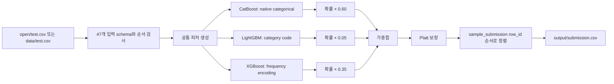

# `/1/submit.zip` 입력·모델·아키텍처 분석

## 1. 한눈에 보는 구조

`/1/submit.zip`은 2019~2024년 공식 `train.csv` 전체로 직접 학습한 세 개의 트리 부스팅 분류기를 결합한 확률 예측 모델입니다.

```text
47개 공식 입력
  → 공통 파생 피처 및 결측·평활 처리
  → CatBoost 확률 60%
  → LightGBM 확률 5%
  → XGBoost 확률 35%
  → 가중 확률 합산
  → Platt 확률 보정
  → row_id 순서 정렬
  → output/submission.csv
```

- 예측 대상: 현재 투구의 `control_success=1` 확률
- 최종 학습 행: 1,475,092행
- 학습 기간: 2019~2024년 전체
- 최종 입력 수: 47개
- 파생 후 피처 수: CatBoost 91개, LightGBM 96개, XGBoost 91개
- Trackman: 미사용
- 선수 ID: 사용
- class weight 및 재표본: 미사용
- 실제 DACON 점수: 907.58227점
- 2024 개발 예측 Brier/BSS: 0.2479843913 / 729.5776점

## 2. 제출 ZIP 구조

```text
submit.zip
├── script.py
├── requirements.txt
└── model/
    ├── final_model.joblib
    ├── calibration_model.joblib
    ├── feature_schema.json
    └── ensemble_config.json
```

| 파일 | 역할 |
|---|---|
| `script.py` | 입력 로드, 피처 생성, 세 모델 추론, 보정, 제출 파일 저장 |
| `requirements.txt` | CatBoost 1.2.10, LightGBM 4.7.0, XGBoost 3.2.0 |
| `final_model.joblib` | 세 모델, 모델별 인코더, 피처 상태, 가중치 묶음 |
| `calibration_model.joblib` | 최종 Platt 보정용 로지스틱 회귀 |
| `feature_schema.json` | 입력 순서, 모델별 피처 순서, 범주형 mapping |
| `ensemble_config.json` | 모델 가중치, 보정 방식, 선택 목적함수 |

ZIP에는 학습 데이터, Trackman 원본, 학습 코드, 외부 가중치가 포함되지 않습니다.

## 3. 원본 입력 47개

`row_id`는 모델 입력이 아니라 제출 결과 정렬에만 사용합니다. `control_success`는 학습 정답이며 test에는 없습니다.

### 경기 시점과 유형 6개

- `season`
- `game_month`
- `game_dayofweek`
- `inning`
- `top_bottom`
- `game_type`

### 투구 직전 경기 상황 16개

- 카운트: `balls_before`, `strikes_before`, `outs_before`
- 득점: `run_top_before`, `run_bot_before`, `run_total_before`
- 점수 차: `score_diff_home`, `score_diff_pitcher_team`
- 주자: `runner_on_1b`, `runner_on_2b`, `runner_on_3b`, `num_runners_on`, `base_state`
- 승리 기대·중요도: `home_win_expectancy`, `away_win_expectancy`, `li`

### 선수·팀 6개

- `pitcher_id`, `batter_id`
- `pitcher_hand`, `batter_hand`
- `pitcher_team_id`, `batter_team_id`

### 투수 과거 이력 16개

- 누적량: `asof_pitcher_n`
- 누적 비율: `asof_pitcher_success_rate`, `asof_pitcher_reverse_rate`, `asof_pitcher_middle_rate`, `asof_pitcher_ball_rate`, `asof_pitcher_strike_rate`
- 최근 경기 성공률: `asof_pitcher_prev1_game_success_rate`, `asof_pitcher_prev3_game_success_rate`, `asof_pitcher_prev5_game_success_rate`
- 최근 경기 가운데 비율: `asof_pitcher_prev1_game_middle_rate`, `asof_pitcher_prev3_game_middle_rate`, `asof_pitcher_prev5_game_middle_rate`
- 구종 누적량·구성: `asof_pitcher_pitchmix_n`, `asof_pitcher_fastball_rate`, `asof_pitcher_breaking_rate`, `asof_pitcher_offspeed_rate`

### 타자 과거 이력 3개

- `asof_batter_n`
- `asof_batter_success_rate`
- `asof_batter_middle_rate`

## 4. 공통 파생 피처 49개

47개 원본에서 총 49개를 추가해 최대 96개 피처를 만듭니다.

### 범주 결합 3개

- `hand_matchup`: 투수 손과 타자 손 조합
- `count_state`: 볼·스트라이크 조합
- `runner_out_state`: 주자 상태와 아웃카운트 조합

### 압박 상황 3개

- `close_game`: 투수 팀 기준 점수 차 절댓값이 2 이하
- `late_inning`: 7회 이상
- `pressure_state`: 후반 여부, 접전 여부, `li≥1.5`의 결합

### 표본 수 변환 2개

- `log1p_asof_pitcher_n`
- `log1p_asof_batter_n`

### 경험적 베이즈 평활 10개

투수·타자의 비율 피처 10개를 다음 식으로 평활합니다.

```text
smoothed_rate = (n × observed_rate + 50 × global_prior) / (n + 50)
```

표본이 적으면 전체 학습 평균에 가깝고, 표본이 많으면 원래 비율에 가까워집니다. `alpha=50`이며 global prior는 최종 학습 데이터에서 저장했습니다.

### 최근 투구 상태 9개

- 성공률 1·3·5경기 평균, 범위, 표준편차
- 최근 1·3·5경기 성공률과 누적 평활 성공률의 차이
- 가운데 비율 1·3·5경기 평균, 범위
- 최근 가운데 비율 평균과 누적 평활 가운데 비율의 차이

### 결측·신규 선수 18개

- 결측이 존재하는 공식 비율 16개마다 `__missing` 플래그 추가
- `is_pitcher_cold_start`: 투수 과거 투구 수가 0 이하
- `is_batter_cold_start`: 타자 과거 타석 수가 0 이하

### 기타 4개

- `pitchmix_entropy`: 구종 구성의 다양성
- `score_abs`: 투수 팀 점수 차 절댓값
- `is_pitcher_team_leading`
- `is_pitcher_team_trailing`

위 범주별 계산에서 성공률·가운데 비율 관련 피처를 합산하면 전체 파생 피처는 49개입니다.

## 5. 중복 피처 처리

다음 5개는 다른 열과 완전 또는 준완전 중복 관계라서 CatBoost와 XGBoost에서 제거합니다.

- `asof_pitcher_pitchmix_n`: `asof_pitcher_n`과 동일
- `run_total_before`: 초·말 득점 합으로 복원 가능
- `num_runners_on`: 1·2·3루 플래그 합으로 복원 가능
- `away_win_expectancy`: 홈 승리 기대값과 거의 완전 반대
- `asof_pitcher_offspeed_rate`: 세 구종 비율 합이 1이라 다른 두 비율로 복원 가능

LightGBM에서는 이 5개를 유지합니다. 따라서 CatBoost·XGBoost는 91개, LightGBM은 96개를 사용합니다.

## 6. 모델별 전처리

### CatBoost

- 14개 범주형을 문자열로 전달합니다.
- 결측 범주는 `__MISSING__` 문자열로 변환합니다.
- 투수·타자 ID를 범주형으로 직접 사용합니다.
- CatBoost의 native categorical split을 사용합니다.
- 별도 수치 범주 인코더는 없습니다.

범주형 14개는 `top_bottom`, `game_type`, `base_state`, `game_dayofweek`, 투수·타자 ID, 양 선수 손, 양 팀 ID, 그리고 4개 결합 범주입니다.

### LightGBM

- 동일한 14개 범주형을 학습 데이터 기반 정수 category code로 변환합니다.
- 학습에서 보지 못한 범주는 `-1`입니다.
- 투수 792명, 타자 830명의 mapping이 저장돼 있습니다.
- 중복 피처를 유지합니다.

### XGBoost

- 14개 범주형을 학습 데이터의 출현 빈도로 변환합니다.
- 학습에서 보지 못한 범주는 빈도 `0`입니다.
- XGBoost가 범주를 단순 번호가 아닌 선수·상태별 학습 출현 비중으로 봅니다.

## 7. 모델 아키텍처와 하이퍼파라미터

| 항목 | CatBoost | LightGBM | XGBoost |
|---|---:|---:|---:|
| 앙상블 가중치 | 0.60 | 0.05 | 0.35 |
| 트리 수 | 108 | 100 | 100 |
| learning rate | 0.03 | 0.04 | 0.04 |
| 트리 깊이 | 9 | 제한 없음 | 7 |
| 주요 복잡도 | `l2_leaf_reg=20` | `num_leaves=31` | `min_child_weight=20` |
| 표본 추출 | 기본값 | `subsample=0.8` | `subsample=0.8` |
| 열 추출 | 기본값 | `colsample_bytree=0.8` | `colsample_bytree=0.8` |
| L2 | 20 | 20 | 10 |
| seed | 42 | 42 | 42 |
| CPU | 6 threads | 6 threads | 6 threads |
| 학습 목적 | Logloss, Brier 평가 | binary | binary logistic |

각 모델은 단일 seed 42입니다. seed bagging은 없습니다.

검증 fold의 early stopping 최적 반복 수 중앙값을 사용하고 최소 트리 수를 100으로 강제했습니다. 그 결과 CatBoost는 108개, LightGBM과 XGBoost는 각각 100개가 됐습니다.

## 8. 앙상블과 Platt 보정

세 모델의 양성 클래스 확률을 다음처럼 합산합니다.

```text
p_raw = 0.60 × p_catboost + 0.05 × p_lightgbm + 0.35 × p_xgboost
```

그다음 원시 확률을 logit으로 바꾸고 Platt 로지스틱 회귀를 적용합니다.

```text
logit(p_raw) = log(p_raw / (1 - p_raw))
p_final = sigmoid(1.1698290112 × logit(p_raw) - 0.0479434454)
```

기울기 1.1698은 0.5에서 떨어진 확률을 조금 더 벌리고, 음의 절편은 전체 확률을 약간 낮추는 효과가 있습니다.

## 9. 학습과 검증

- 전체 학습 데이터: 1,475,092행, 2019~2024
- 타깃 평균: 0.523766
- 시간 검증:
  - 2019~2021 학습 → 2022 검증
  - 2019~2022 학습 → 2023 검증
  - 2019~2023 학습 → 2024 검증
- 앙상블 선택 목적함수: `0.2×Brier(2022) + 0.3×Brier(2023) + 0.5×Brier(2024)`
- 가중치는 0.05 간격으로 탐색했습니다.
- Platt/temperature/isotonic/미보정을 비교해 Platt를 선택했습니다.
- 최종 세 모델은 선택 후 2019~2024 전체로 다시 학습했습니다.

최종 모델 학습 시간은 CatBoost 37.0초, LightGBM 11.5초, XGBoost 7.5초였습니다. 전체 탐색과 검증은 약 1,070초였습니다.

## 10. 검증 성능

| 모델 | 2022 Brier | 2023 Brier | 2024 Brier |
|---|---:|---:|---:|
| CatBoost | 0.243591 | 0.249983 | 0.248351 |
| LightGBM | 0.244057 | 0.251298 | 0.248800 |
| XGBoost | 0.243442 | 0.251000 | 0.248060 |
| 최종 원시 앙상블 | - | - | 0.248141 |
| 최종 Platt 보정 | - | - | **0.247984** |

- 2024 공식 환산 BSS: 729.58점
- 실제 DACON 점수: 907.58227점
- 전체 OOF 원시 앙상블: Brier 0.247225, BSS 1100.79점
- 전체 OOF 보정 후 진단: Brier 0.247075, BSS 1160.68점

1160.68점은 같은 전체 OOF로 보정기를 학습하고 다시 평가한 값이라 독립 검증 점수로 보면 안 됩니다.

## 11. 변수 중요도 해석

모델마다 중요도 정의가 달라 절댓값을 직접 비교하면 안 되지만, 상위 변수는 다음과 같습니다.

### CatBoost

1. `game_type`
2. `season`
3. `hand_matchup`
4. 평활 투수 누적 성공률
5. 타자 팀 ID
6. 원본 투수 누적 성공률
7. 투수 팀 ID
8. 투수 ID

### LightGBM

1. `pitcher_id`
2. `batter_id`
3. `season`
4. `game_type`
5. `hand_matchup`
6. `count_state`

### XGBoost

1. 원본 투수 누적 성공률
2. `game_type`
3. `season`
4. 평활 투수 누적 성공률
5. 최근 1·3·5경기 성공률 평균

즉 `/1` 성능은 과거 투수 성공률뿐 아니라 `season`, `game_type`, 선수 ID에 상당히 의존합니다. `/2`에서 이 항목들을 제거한 것이 성능 악화 원인 후보입니다.

## 12. 추론 흐름



추론 코드는 중복 ID, 입력 schema, 컬럼 순서, 예측 행 수, NaN·무한대, 확률 범위, 제출 ID 집합과 순서를 모두 검사합니다.

## 13. 자원 사용

- ZIP: 1,133,766바이트
- 압축 해제: 1,255,087바이트
- 모델 관련 파일: 1,242,623바이트
- 5행 모델 로드: 약 0.57초
- 5행 추론: 약 0.044초
- 245,789행 추론: 약 3.29초
- 245,789행 최대 RAM: 약 1.43GB
- GPU: 필요 없음
- 외부 인터넷/API 호출: 없음

## 14. 장점

- 서로 다른 범주 처리 방식의 세 모델을 결합합니다.
- 공식 `asof_*` 과거 피처를 중심으로 현재 투구 이전 정보만 사용합니다.
- 적은 표본의 비율을 alpha 50으로 안정화합니다.
- 신규 선수와 결측을 명시적으로 표시합니다.
- 최종 출력이 0/1이 아니라 보정된 확률입니다.
- test 내부 집계 없이 각 행을 독립적으로 변환합니다.
- 제출 스키마와 실행 자원에 큰 여유가 있습니다.

## 15. 한계와 위험

1. 앙상블 가중치가 2024 결과를 포함해 선택됐으므로 2024 Brier는 완전한 sealed holdout이 아닙니다.
2. early stopping에 outer validation을 직접 사용해 각 fold 점수가 다소 유리할 수 있습니다.
3. 최종 보정기는 2022~2024 OOF 전체로 학습돼 전체 OOF 보정 점수는 낙관적입니다.
4. 단일 seed 42라 seed 변동성을 줄이지 못했습니다.
5. `season`과 `game_type` 의존도가 매우 높아 2025 분포 이동에 민감합니다.
6. LightGBM은 선수 ID를 categorical feature로 처리하지만 고카디널리티 ID에 과적합하거나 미관측 ID가 `-1`로 한꺼번에 처리될 수 있습니다.
7. XGBoost 빈도 인코딩은 빈도가 같은 선수를 구분하지 못합니다.
8. 신규 선수는 CatBoost의 미관측 범주, LightGBM `-1`, XGBoost 빈도 0으로 처리돼 cold-start 성능이 제한됩니다.
9. Trackman 공식 과거 로그를 사용하지 않았습니다.
10. 최종 트리가 100~108개로 제한돼 더 깊은 탐색 여지가 있습니다.

## 16. 핵심 결론

`/1/submit.zip`은 `season`, `game_type`, 선수 ID, 투수 누적 성공률과 최근 경기 이력을 중심으로 세 가지 부스팅 모델을 결합하고 Platt 보정한 확률 앙상블입니다. `/2`를 개선할 때는 `/1`의 ID·시즌·경기 유형·Platt 보정을 한꺼번에 제거하면 안 되며, 동일 fold에서 하나씩 ablation한 뒤 더 좋은 요소를 유지해야 합니다.
